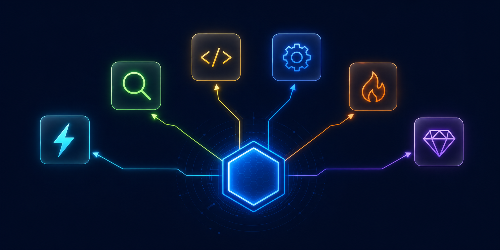

# Multi-Model Orchestration Router



**Route AI tasks to the optimal model across 3 providers and 6 cost tiers - automatically.**

[](LICENSE)
[](https://python.org)
[](#model-tiers)

---

## Problem

You have access to Claude, GPT, and Gemini. Each model excels at different tasks and costs differently. Without a routing strategy, you either:
- **Overspend** by sending everything to the most expensive model
- **Underperform** by using a cheap model for complex tasks
- **Waste time** manually choosing the right model for each task

## Solution

A 6-tier routing system that classifies each task and sends it to the best model for the job, balancing intelligence, cost, and latency.

```
Task in -> Classify -> Route -> Execute -> Escalate if needed
```

Zero dependencies beyond Python 3.9+. No frameworks, no cloud services.

---

## Model Tiers

| Tier | Model | Provider | Cost | Best For |
|------|-------|----------|------|----------|
| 1 | Haiku 4.5 | Anthropic | $1/$5 per MTok | Classification, tagging, format validation, routing |
| 2 | Gemini 2.5 Pro | Google | Low | Summarization, extraction, translation, broad context |
| 3 | GPT-5.3 Codex | OpenAI | Low-Med | Focused coding, refactoring, tests |
| 4 | Sonnet 4.6 | Anthropic | $3/$15 per MTok | Standard engineering, debugging, Russian content |
| 5 | Fable 5 | Anthropic | $10/$50 per MTok | Narrative, storytelling, creative brainstorm |
| 6 | Opus 4.8 | Anthropic | $5/$25 per MTok | Architecture, security, root cause analysis |

## How It Works

### Task Classification

Every task is classified before execution:

```python
# Input
"set up CI/CD pipeline with Docker"

# Router output
ROUTE: sonnet-engineer | COST_TIER: medium | WHY: standard engineering task
```

### Automatic Escalation

```
haiku (if classification is enough)
  -> gemini / openai (by task type)
    -> sonnet (main workhorse)
      -> fable (if creative)
      -> opus (if risky / deep architecture)
```

If a model can't handle the task or returns an error, the system escalates to the next tier automatically. No manual intervention needed.

### Task-to-Model Matrix

| Task Type | Examples | Model | Why |
|-----------|---------|-------|-----|
| Classification | "is this a bug or feature?", sort tickets | Haiku | Instant, cheap, accurate for binary decisions |
| Format validation | Check JSON, validate schema | Haiku | No deep reasoning needed |
| Summarization | Document digest, log analysis, translation | Gemini | Large context window, low cost |
| First draft | Blog post outline, email draft | Gemini | Cheap starting point, refine with Sonnet |
| Focused coding | Write a function, refactor, test | GPT Codex | Optimized for code |
| Standard engineering | Multi-file edits, debugging, integrations | Sonnet | Balance of speed and quality |
| Russian content | Posts, sales scripts, client messages | Sonnet | Best Russian language understanding |
| Creative content | Storytelling, metaphors, unusual formats | Fable | Built for narrative and creativity |
| Wild brainstorm | "find non-obvious connections between X and Y" | Fable | Unexpected associations |
| Architecture | System design, stack selection | Opus | Deep reasoning, sees consequences |
| Security audit | Vulnerability review, threat analysis | Opus | Can't afford to cut corners |
| Hard debugging | "spent 2 hours, still can't figure out why" | Opus | Sees non-obvious dependencies |

---

## Router Architecture

### Skill Router (skill_router.py)

The skill router matches incoming tasks against 100+ registered skills using:

1. **Trigger matching** - each skill has trigger phrases (score: +3.0 per match)
2. **ID matching** - skill name contains query terms (score: +2.0)
3. **Description matching** - fuzzy match against skill descriptions (score: +1.0)
4. **Phrase matching** - full phrase found in triggers (score: +4.0)
5. **Exact ID match** - query matches skill ID exactly (score: +5.0)

Priority weighting:
- `primary` skills: 1.5x multiplier
- `conditional` skills: 0.5x
- `fallback` skills: 0.3x
- `duplicate` skills: excluded

### Group Adjacency

Skills are organized into semantic groups with defined adjacency relationships. After finding direct matches, the router suggests **potential next steps** from adjacent groups:

```
content-marketing <-> design-media <-> coding-dev
automation-api <-> coding-dev <-> devops-cicd
ai-ml-agents <-> coding-dev <-> research-analytics
```

### Bilingual Support

The router handles both Russian and English queries via a synonym expansion system:

```python
"deploy" -> ["deploy", "deploy", "release", "deployment"]
"test" -> ["test", "testing", "tester"]
```

---

## Routing Policy

### Classification Rules

1. **Cheapest first.** haiku < gemini < openai < sonnet < fable/opus
2. **Direct answer over delegation** - if the task is simple, answer directly
3. **Haiku for gate-keeping** - if it's just classification/validation, use Haiku
4. **Fable for creative** - storytelling and narrative, not Sonnet
5. **Don't spawn agents without reason** - only when context isolation is needed

### Escalation Policy

1. Start from cheapest viable route
2. For gate-keeping (classify, validate, parse) -> Haiku first
3. If external worker returns UNAVAILABLE or ERROR -> escalate to Sonnet
4. If Sonnet is uncertain or task involves risk -> escalate to Opus
5. For creative/narrative tasks -> Fable (not Sonnet)
6. Escalate only once per level

---

## Usage

### Route a Task

```bash
python skill_router.py "set up CI/CD pipeline with Docker"
```

Output:
```
DIRECT (apply now):
  1. cicd-quick-setup [devops-cicd] (score: 60.0)
  2. ci-cd-automation [devops-cicd] (score: 48.0)

POTENTIAL (next steps):
  1. test-driven-development [code-quality] (score: 12.0)
```

### Route with JSON Output

```bash
python skill_router.py --json "debug memory leak in Python"
```

### Post-Task Recommendations

After completing a task, get suggestions for what to do next:

```bash
python skill_router.py --post-task cicd-quick-setup,ci-cd-automation "deployed CI/CD pipeline"
```

---

## File Structure

```
multi-model-router/
  skill_router.py        # Main routing engine
  router_policy.md       # Classification rules and escalation logic
  router_registry.md     # Complete model + skill registry
  config.py              # Configuration paths
  examples/
    routing_examples.md  # Real-world routing scenarios
```

---

## Key Design Decisions

**Why not just use the best model for everything?**
Cost. Opus at $5/$25 per MTok is 5x more expensive than Haiku at $1/$5. For a task that Haiku handles perfectly (classification, validation), using Opus wastes money with no quality gain.

**Why 6 tiers and not 3?**
Each tier covers a distinct cost/capability niche. Haiku is not just "cheap Sonnet" - it's optimized for speed on simple tasks. Fable is not just "expensive Opus" - it generates more creative output. The tiers exist because the models genuinely differ, not for complexity's sake.

**Why cross-provider routing?**
No single provider has the best model for every task. Gemini has the largest context window for cheap summarization. OpenAI Codex is strong at focused coding. Claude excels at reasoning and multilingual content. The router picks the best tool regardless of provider.

---

## License

Apache 2.0 - see [LICENSE](LICENSE) for details.
